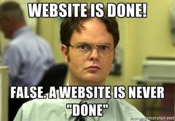

**50+ Amazing software tools for web developers (Part-1) 🚀🙆🏻‍♂️**

Welcome to the comprehensive list of more than 50 tools and resources that have been useful to me as I’ve learned (and still learning) about web development. These resources help you build stunning websites and web-apps. You’ll benefit from these technologies in a variety of ways, including productivity. 

There are numerous tools that you might not be familiar with in addition to the ones you already know. It will enable you to increase your output and produce a better website application.

Your task will be easier with these tools. Making use of web development tools usually makes work simpler and more efficient. They are frequently required in the field of web development, which is why we have created this list, which you can bookmark and use to hunt up any tool you need.

Since there are many tools accessible, we do not declare this list to be exhaustive. In the comments box below, you can share which tools from the list are your favorites'.

Let’s get started with the list now.

**Learning 🧑🏻‍💻**

[**W3School** ](https://www.w3schools.com/)

Tutorials for creating websites that are well-structured and simple to comprehend, with lots of examples showing how to utilize HTML, CSS, JavaScript, SQL, Python, PHP, Bootstrap, Java, and other technologies.

This website is undoubtedly familiar to web developers. W3School’s website will be among the top results if you search for any HTML, CSS, and JavaScript terms on Google. It’s a fantastic website for sequentially learning web programming. It can also be used to learn various terminologies used in web development.

[**freeCodeCamp**](https://www.freecodecamp.org/)

Learn to Code — For Free

One of the best places to learn a multitude of things all at once is FreeCodeCamp. It has YouTube channels for video tutorials as well as a blog platform. Every single tutorial and blog is of the highest calibre and made by talented authors. Through freeCodeCamp’s YouTube courses, I have learnt React. If you want to learn anything about technology, I highly suggest using their YouTube channel.

[**CSS-Tricks**](https://css-tricks.com/)

Daily articles about CSS, HTML, JavaScript, and all things related to web design and development.

There are several tutorials and guidelines about CSS. The majority of CSS-related topics have been addressed, and they continue to publish new posts to cover issues outside of CSS. Their code-friendly guide is fantastic. They contain code samples (kind of a cheat sheet) and visuals to easily illustrate various complex CSS principles, like flex.

[**Scrimba**](https://scrimba.com/)

Scrimba is a fun and fast way of learning to code! Our interactive courses and tutorials will teach you React, Vue, Angular, JavaScript, HTML, CSS, and more.

A website that offers both free and paid interactive classes. There are 20 free courses available on topics like Python and web development. My favorite course on their website to learn Modern React as a beginner is Learn React for Free. There are various pathways you can take as you explore the course.

[**Devhints**](https://devhints.io/)

A ridiculous collection of web development cheatsheets.

Explore a selection of cheat sheets. To make it easier to grasp, they are properly grouped into a component manner. For HTML, CSS, JavaScript, React, Vue, ExpressJS, and many other languages, they have cheat sheets. For more than 25 themes, which are further broken into subtopics, they provide cheatsheets.

**Code Editor✍**

[**VS Code**](https://code.visualstudio.com/)

Visual Studio Code is a code editor redefined and optimized for building and debugging modern web and cloud applications. Visual Studio Code is free and available on your favorite platform

*- Linux, macOS, and Windows.*

VS Code is highly customizable and supports a broad variety of extensions. I’ve been using VS Code for more than two years, and I adore it. Its own terminal eliminates the need for you to switch between it and the code editor. I use their terminal a lot.

[**Sublime**](https://www.sublimetext.com/)

Sublime Text is a sophisticated text editor for code, markup, and prose. You’ll love the slick user interface, extraordinary features, and amazing performance.

A gorgeous and simplistic coding editor is called Sublime. Although it has a simple look, you can use it as your main code editor. Additionally, it can be used for rapid editing. You can use the unregistered version even though there is a paying plan. Although the unregistered version is a full version, it prompts you to buy the plan after 40 saves.

[**CodePen**](https://codepen.io/)

CodePen is a social development environment for front-end designers and developers. Build and deploy a website, show off your work, build test cases to learn and debug, and find inspiration.

An online web development editor is called CodePen. JavaScript, CSS, and HTML are all supported. The majority of the JavaScript and CSS libraries are supported. Sharing the codepen with other developers is simple. It has been useful for sharing produced webpages.

[**CodeSandBox**](https://codesandbox.io/)

CodeSandbox is an online code editor and prototyping tool that makes creating and sharing web apps faster

a fantastic online code editor that supports a variety of settings. Their template works with React, NodeJS, Gatsby, and other platforms. Other developers can easily access the developed sandbox and collaborate on it. It is simple to embed into a web page. I share the website and individual pages for my blog with other developers using CodeSandBox.

[**Brackets**](https://brackets.io/)

Brackets — A modern, open source code editor that understands web design.

A straightforward text editor made especially for web developers. It has features like a pre-installed live server that will automatically reload as you make changes to your website. You can make use of the code editor for the live server and basic functionality.

**UI Designing ⚡**

[**Figma**](https://www.figma.com/)

Build better products as a team. Design, prototype, and gather feedback all in one place with Figma.

One of the most well-liked tools for producing mockups and user interface designs for the web and mobile is Figma. It contains a tonne of tools and is simple to use. You can download the software or use it on your website. It is more powerful and has additional capabilities thanks to the availability of plugins. I use it to produce prototypes in Figma for my web pages. Additionally, I utilize it to modify pre-existing Figma designs to suit my needs.

[**Adobe XD**](https://www.adobe.com/in/products/xd.html)

Adobe XD is a fast & powerful UI/UX design solution for websites, apps & more. Design, wireframe, animate, prototype, collaborate & share — all in one place.

One of the Figma alternatives is Adobe XD. It offers several features for creating UI designs, just like Figma. When I first started, I utilised Adobe XD to make mockups and designs.

[**Dribbble**](https://dribbble.com/)

Find Top Designers & Creative Professionals on Dribbble. We are where designers gain inspiration, feedback, community, and jobs. Your best resource to discover and connect with designers worldwide.

One of the most well-liked sources of UI design inspiration is the website Dribbble. There are numerous mockups and user interface (UI) designs available for the web, mobile, print, and animation. Other developers can view your design after you create and publish it. Through the platform, several individuals have obtained freelancing opportunities and been hired.

[**UI Design Daily**](https://uidesigndaily.com/)

Free, Open-source UI design resources are updated daily.

I have used the UI design on a daily basis to obtain UI design ideas for React components. For components like cards, buttons, forms, log-in, and others, there are numerous mockups available.

[**Figma Community**](https://www.figma.com/community/)

Explore thousands of templates, widgets, and plugins by the Figma Community.

Figma is a tool for creating mockups and UI/UX designs, as you may know. Awesome online and mobile mockups are available in its community. Use of this user interface is free. You can quickly duplicate into your Figma account and then edit as necessary. When I have to work on a web project, I most surely visit this website.

[**SiteInspire**](https://www.siteinspire.com/)

A showcase of the best web design inspiration, featuring over 7,000 websites and profiles of the digital agencies, designers, and developers who made them.

A nice collection of website designs to spark your creativity. From a variety of categories, including Styles, Types, Subjects, and Platforms, you can select a design. You may also type your search terms directly into the search box. To be included on the website, submit your website design.

[**Awwwards**](https://www.awwwards.com/)

Awwwards are the Website Awards that recognize and promote
the talent and effort of the best developers, designers, and web
agencies in the world.

One of the top websites on the internet is Awwwards. It offers a good selection of websites to browse for UI/UX ideas. The best websites are also given awards in the form of recognition and badges to display. Additionally, you can submit your website.

**Conclusion 📒**

These are the useful tools for web developers in 2022, then. Here, we’ve compiled 10+ Practical Tools to make your work quick and simple.

Make a list of the tools you require, then choose from it as needed. We hope that this collection will assist you in finding the best one for your upcoming project.

Do tell us which one you are utilizing from the list or out of the list in the comment area below. Don’t forget to distribute this list to your coworkers as well; after all, caring is sharing. 😍

**GitHub URL for this article 💻**

[https://github.com/devangtomar/medium-awesome-web-tools.git](https://github.com/devangtomar/medium-awesome-web-tools.git)

**Let’s connect and chat! Open to anything under the sun 🏖️🍹**

**🐦 Twitter :** [devangtomar7](https://twitter.com/devangtomar7)
**🔗 LinkedIn : [devangtomar](https://www.linkedin.com/in/devangtomar)**
**📚 Stackoverflow :** [devangtomar](https://stackoverflow.com/users/8198097/devangtomar)
**🖼️ Instagram :** [be_ayushmann](https://instagram.com/be_ayushmann)
Ⓜ️ **Medium :** [Devang Tomar](https://medium.com/u/8f5e1c86129d?source=post_page-----e42119a306ca--------------------------------)
☊ **Hashnode :** [devangtomar](https://devangtomar.hashnode.dev/)
**🧑‍💻 Dev.to :** [devangtomar](https://dev.to/devangtomar)

