Here goes the rest of the lists...

{width="8.333333333333334in"
height="5.591666666666667in"}

### UI Component üöÄ

#### [Flaticon](https://www.flaticon.com/)

Download Free Icons and Stickers for your projects. Resources made by
and for designers. PNG, SVG, EPS, PSD, and CSS formats

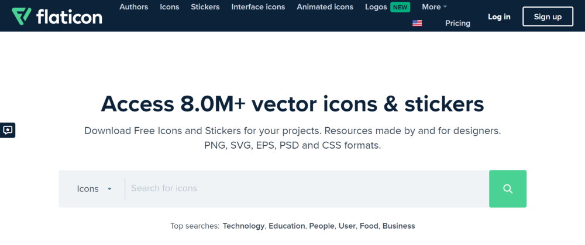{width="8.333333333333334in"
height="3.5in"}

You can utilise a vast collection of icons from FlatIcon to design and
create a website. Over 8 million vectors and stickers are available.
They have a platform that I utilise to get various icons for the
websites. They have several distinct icons in various sizes. There are
formats for icons in SVG, PSD, PNG, and EPS.

#### [Blush Design](https://blush.design/)

Blush makes it easy to add free illustrations to your designs. Play with
fully customizable graphics made by artists across the globe.

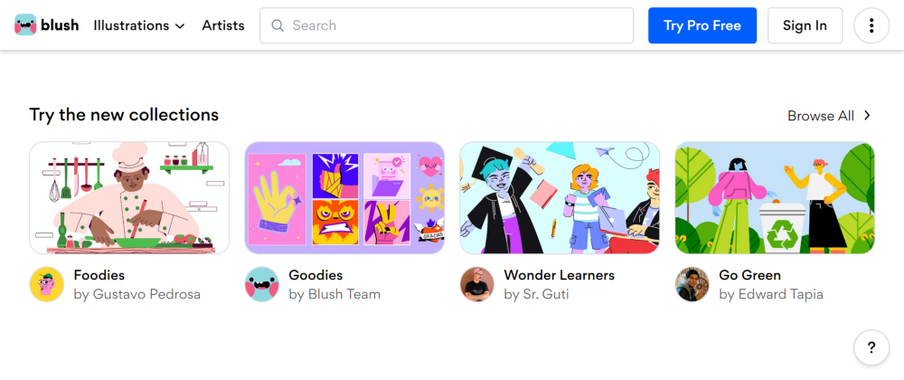{width="8.333333333333334in"
height="3.5in"}

UnDraw allows you to produce personalised graphics. You don't have to
start from scratch when creating an illustration; there are already
components available that you can put together to create a fantastic
design. Additionally, you can download or modify pre-made graphics for
your designs and web pages. I like to use the website's human-type
illustrations to construct landing pages for my website.

#### [ColorHunt](https://colorhunt.co/)

Discover the newest hand-picked color palettes of Color Hunt. Get color
inspiration for your design and art projects.

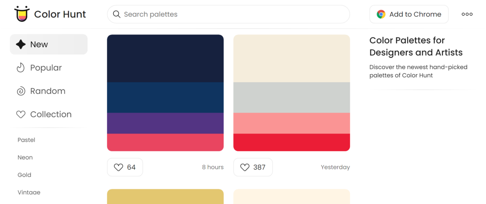{width="8.333333333333334in"
height="3.5in"}

Numerous colour schemes are available for your design. You can find a
tonne of inspiration and colour schemes for your subsequent design. I
frequently go to the website to find the hottest colour schemes. In
addition to using the colour palettes for design, I also used them to
make thumbnails for my articles.

#### [Google Fonts](https://fonts.google.com/)

Making the web more beautiful, fast, and open through great typography

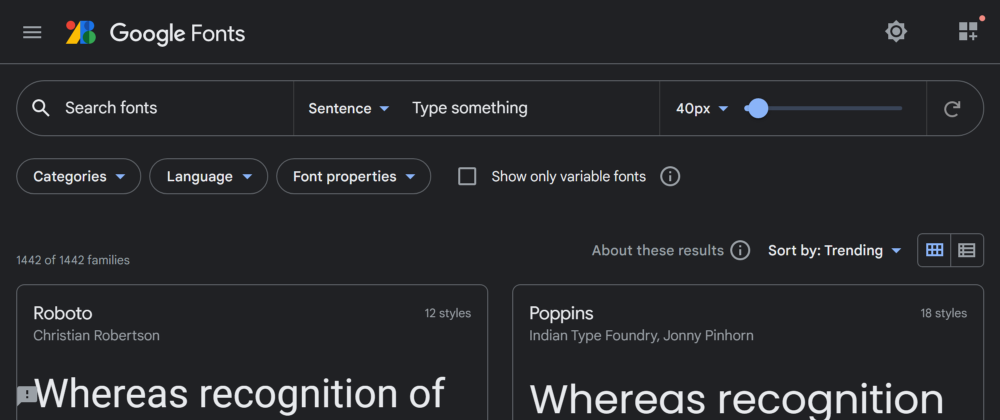{width="8.333333333333334in"
height="3.5in"}

Among the top websites for adding beautiful fonts to your website.
Installing the Google typeface is simple with a link and import. There
are more than 1,400 typefaces in this open-source font collection.
Recently, I've been using it to improve the typefaces on my web pages.
It offers a sizable library of icons in addition to typefaces.

#### [Error 404](https://error404.fun/)

Make a unique journey through 404 error pages on your website. Use these
illustrations that describe better than words

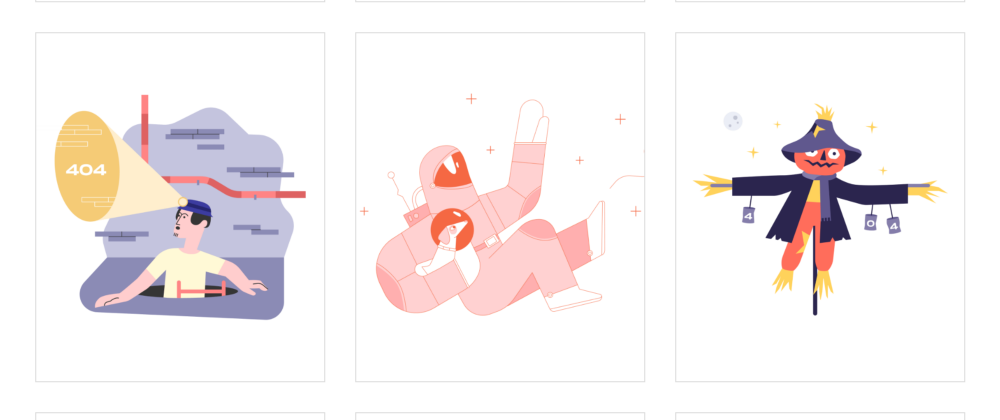{width="8.333333333333334in"
height="3.5in"}

It's a nice website to browse for examples of 404-page error pages. It
offers a tonne of free examples of 404 (Not Found) error pages. Download
it and apply it to your designs and web pages. Additionally, there are
some samples that you can look at for ideas.

### Animation 💃🏻

#### [Anime.js](https://animejs.com/)

Anime.js is a lightweight JavaScript animation library with a simple,
yet powerful API.

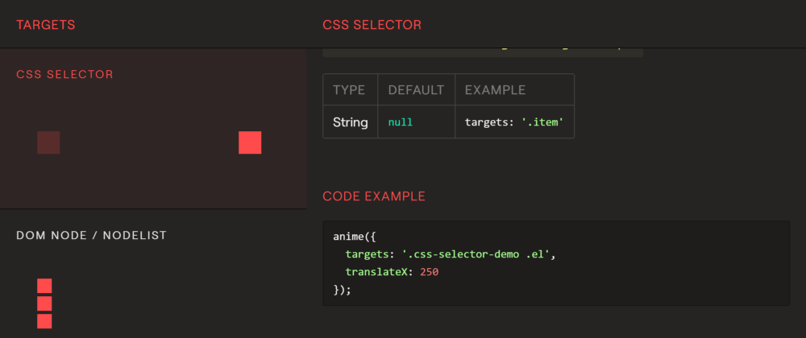{width="8.333333333333334in"
height="3.5in"}

One of my favourite libraries for including animation in my projects is
Anime.js. One library can be used to perform a variety of animations. On
its GitHub repository, it has received more than 43K stars. To generate
the animation, you must use the anime feature.

#### [Framer Motion](https://www.framer.com/motion/)

Framer Motion is a production-ready React animation and gesture library.

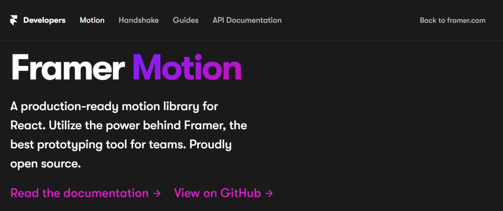{width="8.333333333333334in"
height="3.5in"}

An animation library for React is called Frame Motion. With only two
attributes, the animation is simple to use and adapt. The animation in
your component will be executed after you choose the HTML element
bearing the classname. React and framer motion go well together.

#### [Three Dots](https://nzbin.github.io/three-dots/)

Three Dots is a set of CSS loading animations made with just a single
element

{width="8.333333333333334in"
height="3.5in"}

An intriguing library uses just three dots for its loading animation in
CSS. The animation ranges from simple to complex animation. You can
either link to the external stylesheet or implement it as a npm package
in your application.

#### [Hover.CSS](https://ianlunn.github.io/Hover/)

Hover.css‚Ää---‚ÄäA collection of CSS3 powered hover effects

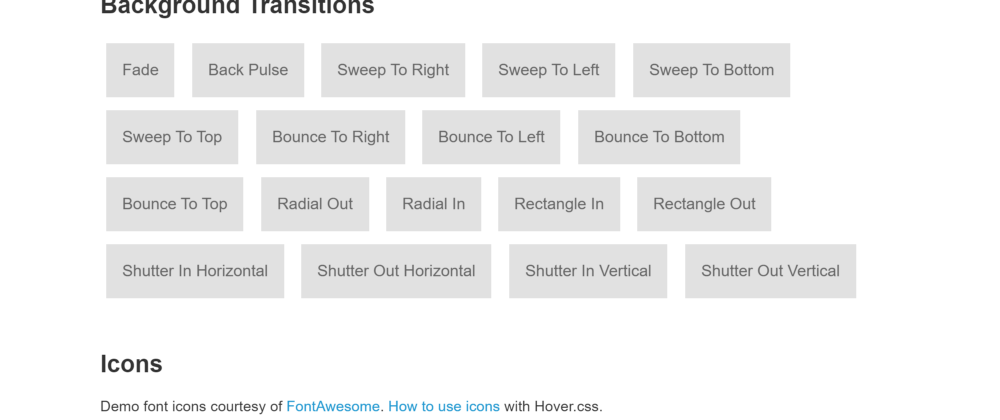{width="8.333333333333334in"
height="3.5in"}

An great selection of links and button hover animation/transition
enabled by CSS3. Animation falls under a variety of areas, including 2D
Transitions, Icons, Curls, and others. There are a total of 7
categories. Integrate the library into your application using a
downloadable CSS file, NPM script, or CDN script.

#### [Popmotion](https://popmotion.io/)

Popmotion: The animator's JavaScript toolbox

{width="8.333333333333334in"
height="3.5in"}

A straightforward yet effective library for adding animation to your web
application. The components are tiny in size and the library is
extremely reliable, which slows down how quickly your site loads. On
GitHub, it has gotten more than 19K stars.

### Framework 🏢

#### [React](https://reactjs.org/)

A JavaScript library for building user interfaces.

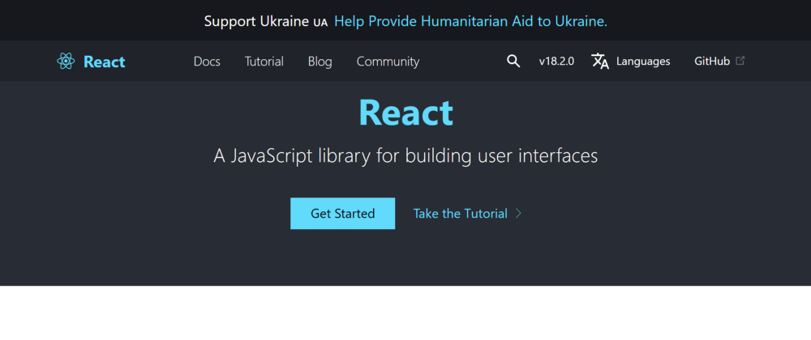{width="8.333333333333334in"
height="3.5in"}

One of the most popular and effective JavaScript frameworks for creating
component-based webpages is React. Most of the websites I have built
utilising React have been done so by me. It has a reduced learning curve
and is simple to learn. Within two to three weeks, you will be able to
develop the website using React.

#### [NextJS](https://nextjs.org/)

Production grade React applications that scale. The world's leading
companies use Next.js by Vercel to build static and dynamic websites and
web applications.

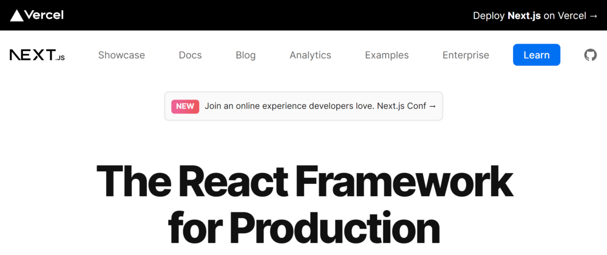{width="8.333333333333334in"
height="3.5in"}

A React framework is called NextJS. By adding new functionality, it has
improved React's quality. I recently switched to NextJS instead of only
utilising React to develop my website. NextJS's routing mechanism is
really cool since you have to arrange your files in accordance with the
route you wish to take.

#### [Astro](https://astro.build/)

Pull content from anywhere and serve it fast with Astro's next-gen
island architecture. Astro is the web framework that you'll enjoy using.

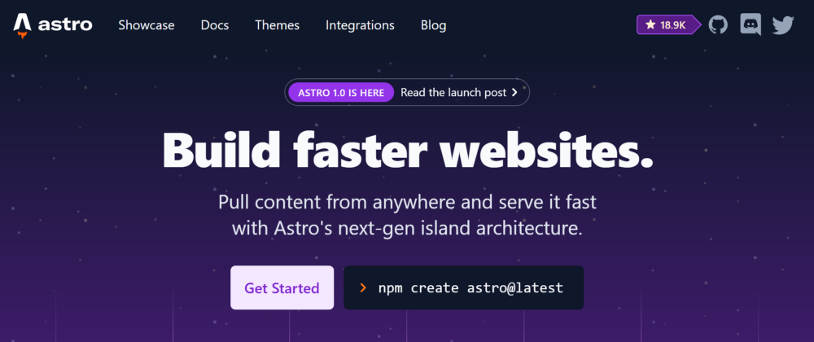{width="8.333333333333334in"
height="3.5in"}

A web development framework based on React is called Astro. When
compared to React and NextJS, it is quite light. Its superior
performance over competing frameworks is a result of this. It offers a
number of features for improving performance, including Lazy- Loading
and Zero JavaScript Runtime.

#### [Tailwind CSS](https://tailwindcss.com/)

Tailwind CSS‚Ää---‚ÄäRapidly build modern websites without ever leaving your
HTML.

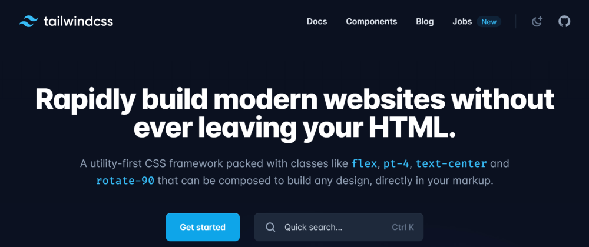{width="8.333333333333334in"
height="3.5in"}

It is a CSS framework focused on utilities. You may directly apply CSS
to your HTML/JSX components with Tailwind CSS. Since writing CSS code
for this framework takes less time, many developers have begun using it
to design their websites.

#### [Bulma](https://bulma.io/)

Bulma is a free, open-source CSS framework based on Flexbox and built
with Sass. It's 100% responsive, fully modular, and available for free.

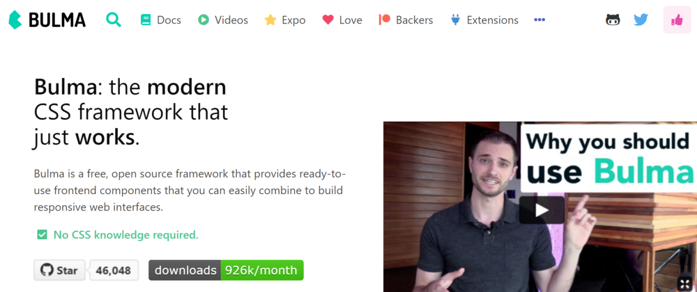{width="8.333333333333334in"
height="3.5in"}

Bulma is a CSS framework that may be used to write CSS in HTML and JSX.
To obtain the CSS code, you simply need to supply various classnames for
the component. To add the library to your project, you can either
download the necessary files or use package managers. It's fantastic and
simple to incorporate into your project.ect.

#### [ExpressJS](https://expressjs.com/)

Express‚Ää---‚ÄäNode.js web application framework

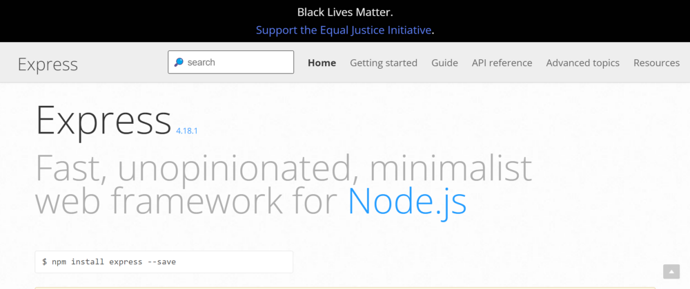{width="8.333333333333334in"
height="3.5in"}

ExpressJS is a framework for creating the backend of your application.
For practically every project, I have built my backend using the
library. It has a short learning curve, is widely used, and is simple to
integrate.

### Hosting 🌨️

#### [Netlify](https://www.netlify.com/)

A powerful serverless platform with an intuitive git-based workflow.
Automated deployments, shareable previews, and much more. Get started
for free!

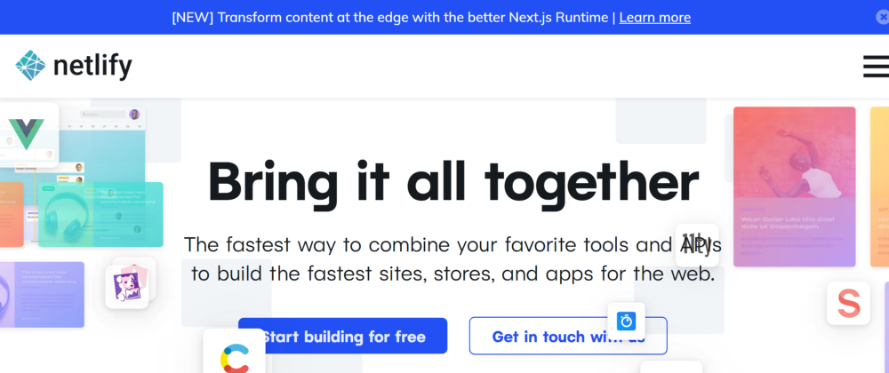{width="8.333333333333334in"
height="3.5in"}

One of the most well-known online applications on hosting service
providers is Netlify. I've been hosting my projects with Netlify ever
since I started working in web development. My preferred hosting
solution for all of my React projects. Building, adding environment
variables, and customising a domain are all simple processes. Your
domain will be available under the netlify.com subdomain in the free
tier. Buying a domain is another option with Netlify.

#### [Vercel](https://vercel.com/)

Deploy web projects with the best frontend developer experience and
highest end-user performance.

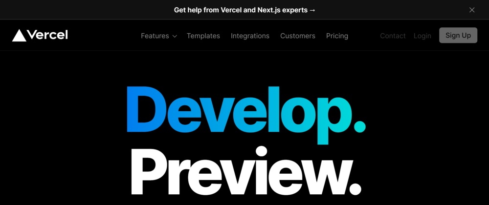{width="8.333333333333334in"
height="3.5in"}

The best hosting company for the NextJS application is Vercel. The
Vercel team is behind the creation of NextJS. Therefore, using Vercel
for performance makes sense.\
The user interface is clear and simple to use. While deploying, there is
the opportunity to select a framework. It improves performance and
customises the server in accordance with the framework to produce a
build. The majority of fronted tech stacks, including React, NuxtJS,
Svelte, Vue, Gatsby, and many others, are supported by it.

#### [Heroku](https://www.heroku.com/)

Heroku is a platform as a service (PaaS) that enables developers to
build, run, and operate applications entirely in the cloud.

{width="8.333333333333334in"
height="3.5in"}

The best platform for launching the backend of your project is Heroku. I
set up my backend on Heroku and my frontend on Netlify or Vercel. Using
their CLI or through GitHub, you can import projects. I just use CLI to
push the project's general code to GitHub and the backend code to
Heroku.

#### [Railway](https://railway.app/)

Railway is an infrastructure platform where you can provision
infrastructure, develop with that infrastructure locally, and then
deploy it to the cloud.

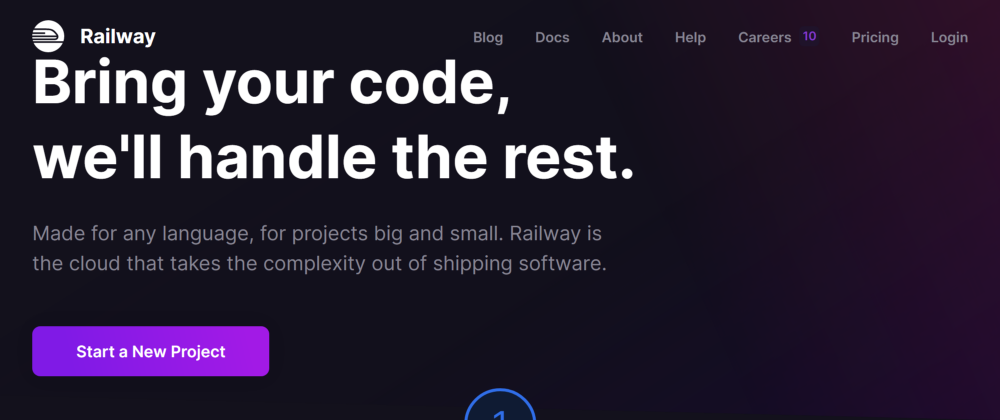{width="8.333333333333334in"
height="3.5in"}

Heroku's free tier will end in November 2022, and one of the finest
substitutes for Heroku to deploy your backend is Railway. Along with
others, it supports Node Js, Django, Laravel, Kotlin Spring, and Ruby.
Additionally, you can use the pre-built templates for installing the
backend.

#### [Render](https://render.com/)

Render is a unified cloud to build and run all your apps and websites
with free TLS certificates, global CDN, private networks and auto deploy
from Git.

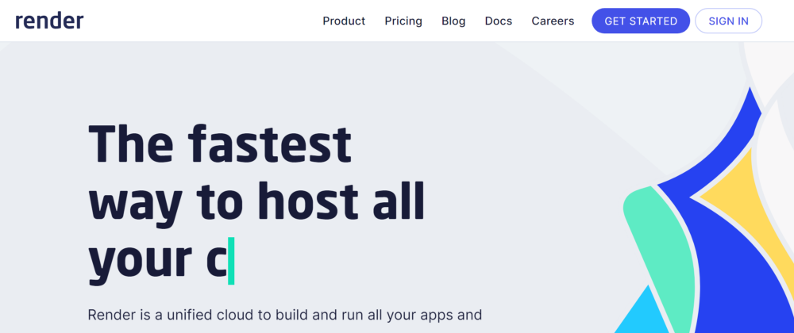{width="8.333333333333334in"
height="3.5in"}

Install a wide range of programmes, including Web servers, static web
pages, Docker containers, and more. One of the free Heroku alternatives
is this.

### Google Chrome Extension üîó

#### [ColorZilla](https://chrome.google.com/webstore/detail/colorzilla/bhlhnicpbhignbdhedgjhgdocnmhomnp)

Advanced Eyedropper, Color Picker, Gradient Generator, and more

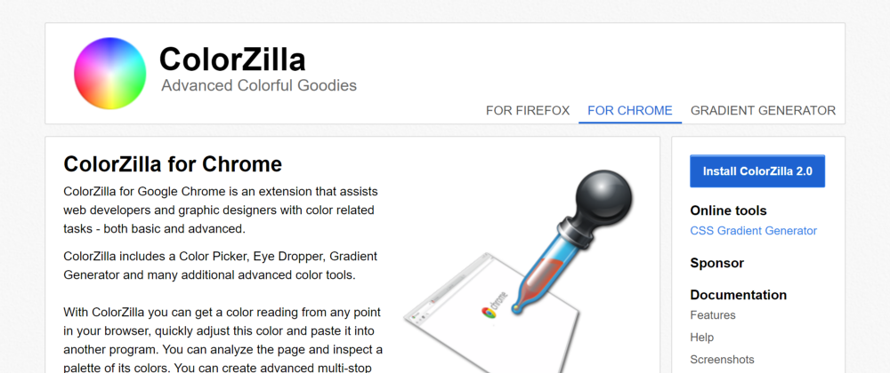{width="8.333333333333334in"
height="3.5in"}

I've been using this plugin ever since I started building websites. This
add-on chooses colours from a webpage.

#### [WhatFont](https://chrome.google.com/webstore/detail/whatfont/jabopobgcpjmedljpbcaablpmlmfcogm)

The easiest way to identify fonts on web pages.

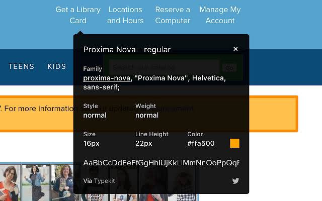{width="5.333333333333333in"
height="3.3333333333333335in"}

Simply hovering over the typeface on any website is one of the best ways
to learn its name. The font's name and size will be visible.

#### [JSONVue](https://chrome.google.com/webstore/detail/jsonvue/chklaanhfefbnpoihckbnefhakgolnmc)

Validate and view JSON documents

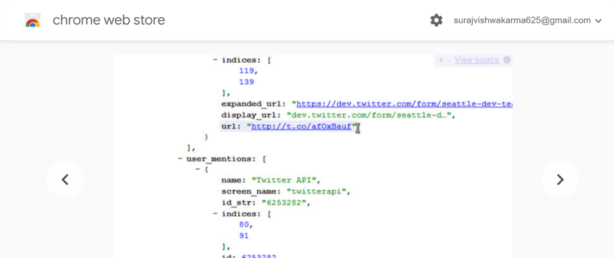{width="8.333333333333334in"
height="3.5in"}

One of the most frequently suggested extensions for the nicer JSON data
is this one.\
whenever I am obtaining data via open APIs, such as weather data. The
API's data is presented as JSON. All of the data is displayed inline by
default on our website. To make the structure of JSON easier to grasp,
this addon transforms the data into a beautiful format.

#### [Wappalyzer](https://chrome.google.com/webstore/detail/wappalyzer-technology-pro/gppongmhjkpfnbhagpmjfkannfbllamg)

Find out the technology stack of any website. Create lists of websites
and contacts by the technologies they use.

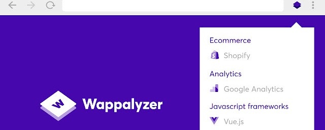{width="5.333333333333333in"
height="2.1333333333333333in"}

Wappalyzer is a fantastic tool for determining a website's tech stack.
You can do that through a variety of channels, including APIs and
browser plugins. It has a browser plugin that will show the visited
website's tech stack. It has offered an API, and you may use it to build
a website similar to Wappalyzer.

#### [GitPod](https://chrome.google.com/webstore/detail/gitpod-always-ready-to-co/dodmmooeoklaejobgleioelladacbeki)

Gitpod is an open-source development platform for remote development.
Accelerate your team's developer experience, remote collaboration, and
security‚Ää---‚Ääto ship new products faster and more securely.

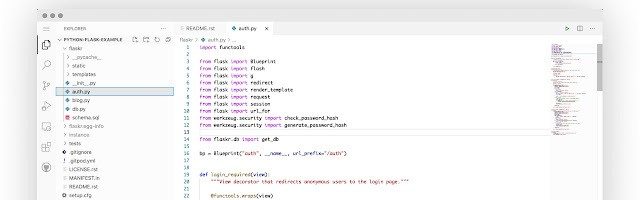{width="5.333333333333333in"
height="1.6666666666666667in"}

I solely utilise this extension on GitHub. It gives me access to the
online editor known as VS Code. I employ this addon to review updated
code. It has all of VS Code's features, including extension and theme.

### Coding Practice 🧭

#### [HackerRank](https://www.hackerrank.com/)

Join over 18 million developers, practice coding skills, prepare for
Interviews, and get hired.

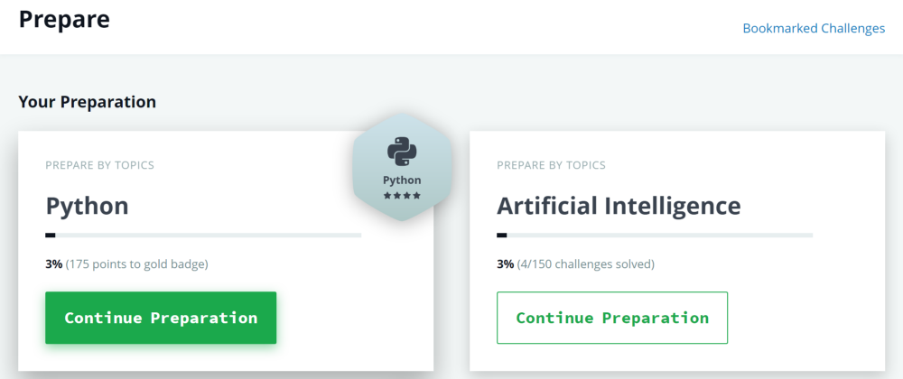{width="8.333333333333334in"
height="3.5in"}

In HackerRank, you can practise more than 40 different languages. To
test your expertise, they have amazing challenges ranging from the
fundamental levels to an advanced one. They also present problems for a
variety of fields, including algorithms, mathematics, SQL, functional
programming, artificial intelligence, and more.

#### [LeetCode](https://leetcode.com/)

Level up your coding skills and quickly land a job. This is the best
place to expand your knowledge and get prepared for your next interview.

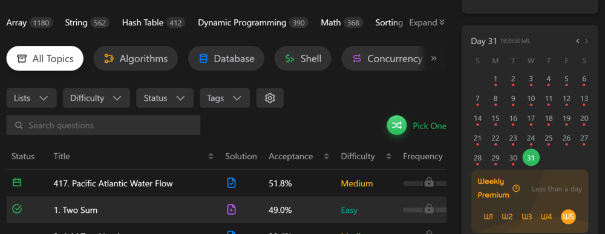{width="8.333333333333334in"
height="3.2333333333333334in"}

Popular web resource Leetcode offers a collection of different
challenges. You might use it to help you get ready for technical job
interviews. They support more than 14 widely used languages.

#### [CodeChef](https://www.codechef.com/)

Learn competitive programming with the help of CodeChef's coding
competitions. Take part in these online coding contests to level up your
skills

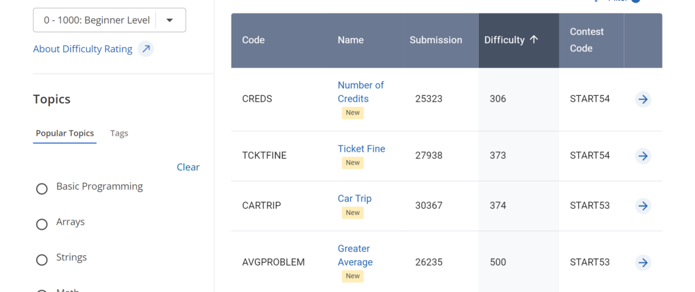{width="8.333333333333334in"
height="3.5in"}

Through various challenges in CodeChef, you can practise several
programming languages. To win a prize, you can take part in their
competition. You can start their " Get Started At CodeChef With Your
Coding Journey " as a complete novice to learn coding while also
practising.

#### [Flexbox Defence](http://www.flexboxdefense.com/)

Your job is to stop the incoming enemies from getting past your
defenses. Unlike other tower defense games, you must position your
towers using CSS!

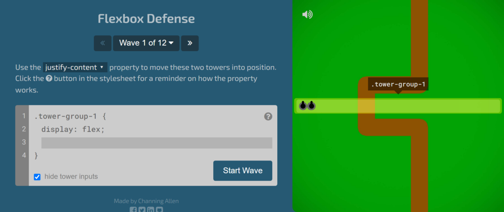{width="8.333333333333334in"
height="3.5in"}

It's a game you can play online while studying CSS flexbox. It is
straightforward; your defence will be located on a map as you write
code. To protect yourself, your defence should be in the enemy's route.
You're going to use CSS flex and its properties to place your defence.
You may study CSS flexbox's characteristics while having fun.

#### [CodinGame](https://www.codingame.com/)

CodinGame is a challenge-based training platform for programmers where
you can play with the hottest programming topics. Solve games, code AI
bots, learn from your peers, and have fun.

{width="8.333333333333334in"
height="3.5in"}

CodinGame allows you to play games while also learning how to programme.
To control the character in the game, you will write code. The majority
of widely used programming languages, including JavaScript, Python, C,
C++, Dart, and others, allow you to write code.

### Productivity ‚åõ

#### [Notion](https://www.notion.so/)

We're more than a doc. Or a table. Customize Notion to work the way you
do.

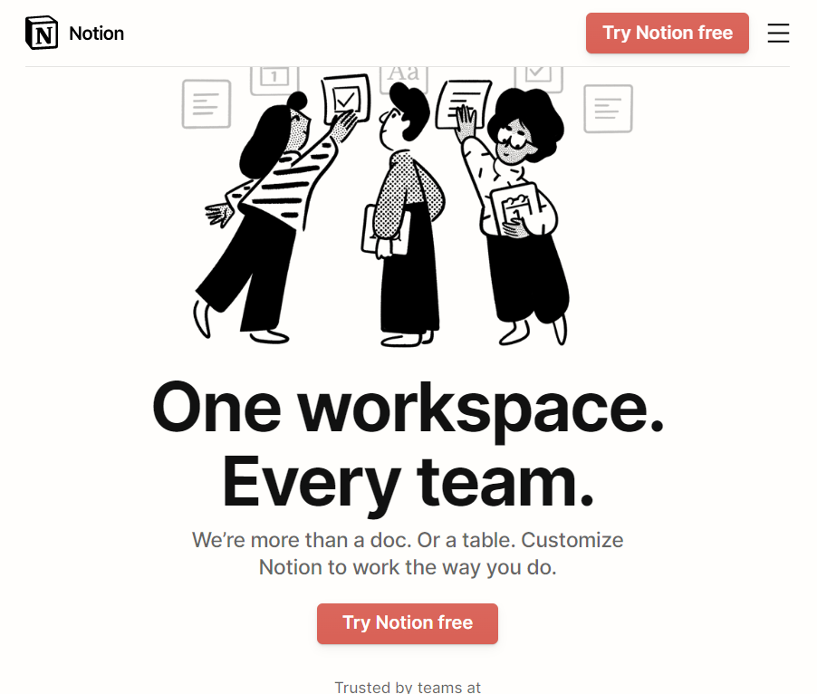{width="7.516666666666667in"
height="6.383333333333334in"}

The single location where most work is managed. I have themes for my
Gumroad ebook interests, reading list, participation in hackathons, and
blog subjects. The idea is simple to use because to the abundance of
both free and premium templates.\
I look online for templates if I need to create new pages, such Personal
Finance. I receive fairly decent templates for free.

#### [Habitica](https://habitica.com/)

Habitica is a free habit and productivity app that treats your real life
like a game. Habitica can help you achieve your goals to become healthy
and happy.

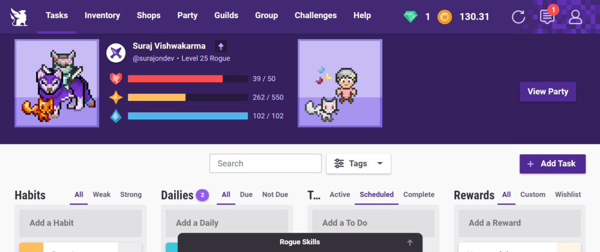{width="8.333333333333334in"
height="3.5in"}

One of the pillars for accomplishing larger goals is developing good
habits. I've been using Habiticas to create new habits and manage my
to-do list. It's a to-do list with a range of things to complete that
has been gamified. I appreciate how Habitica handles routine activities
and habits.

#### [Trello](https://trello.com/)

Trello is the ultimate project management tool. Start up a board in
seconds, automate tedious tasks, and collaborate anywhere, even on
mobile.

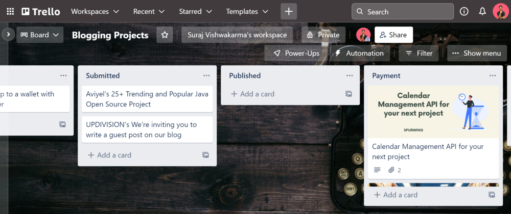{width="8.333333333333334in"
height="3.5in"}

With Trello, you may manage a task that has a progress timetable. I
organised my client's blogging project using Trello, which has tabs for
Writing, Drafting, Sending, and Publishing. It is adaptable and useful
for many different applications because of its versatility. It can also
be used for feature additions, project management, and other things.

#### [musicForProgramming()](https://musicforprogramming.net/latest/)

Datassette presents a series of mixes intended for listening while
programming to focus the brain and inspire the mind.

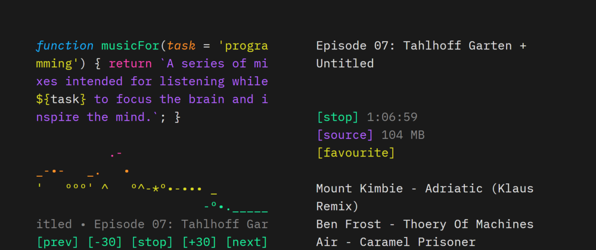{width="8.333333333333334in"
height="3.5in"}

If you enjoy listening to music while programming, musicForProgramming
has many possibilities for you. This music can help you concentrate when
writing computer code.

### Miscellaneous Tool 🔎

#### [Postman](https://www.postman.com/)

Postman is an API platform for building and using APIs. Postman
simplifies each step of the API lifecycle and streamlines collaboration
so you can create better APIs‚Ää---‚Ääfaster.

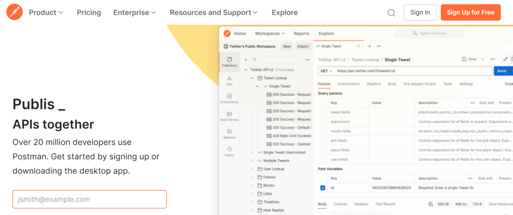{width="8.333333333333334in"
height="3.5in"}

An API testing tool called Postman includes both a desktop and web-based
interface. For testing my backend APIs, I like to use the desktop
application. The transition between each Workspace is simple. It is
possible to add environment variables with different scopes.

#### [Rapid API](https://rapidapi.com/hub)

Use RapidAPI to Find, Connect, & Share 1000s of APIs using our
Multi-cloud platform. Improve Developer Experience with API Design,
Testing, Monitoring, & More!

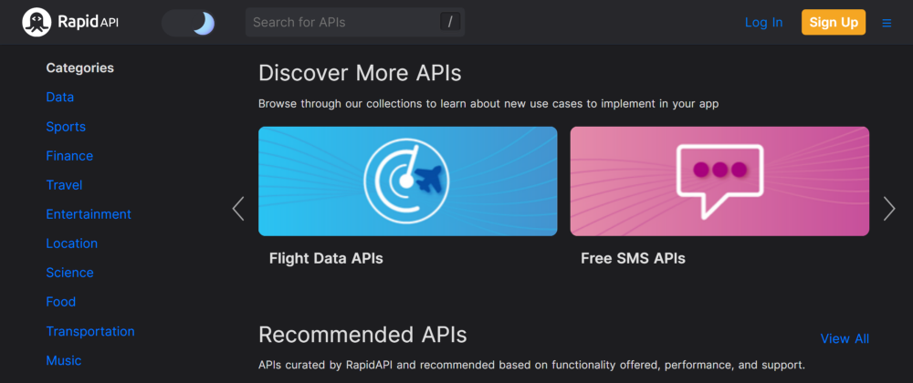{width="8.333333333333334in"
height="3.5in"}

A location where you may locate practically all of the major online
APIs. The APIs have been thoughtfully divided up into more than 20
categories. I go to Rapid API whenever I need any API for a project. You
can look up APIs based on your needs.

#### [Site-Shot](https://www.site-shot.com/)

Site-Shot: Online webpage screenshot service that takes a full page
snapshot. The simplest way to take a full page screenshot, we support up
to 20000 pixels

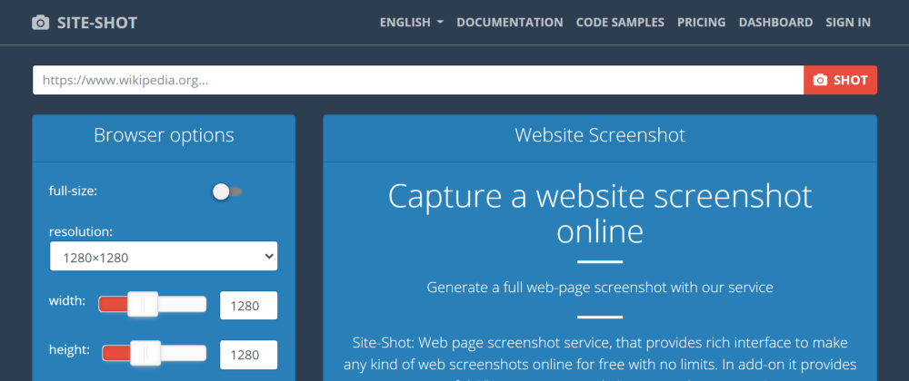{width="8.333333333333334in"
height="3.5in"}

Using site-shot, you may take screenshots of any website. The resolution
can be manually changed on a variety of desktop, Android, and iOS
devices. It offers API so you can create a site similar to site-shot on
your own.

#### [PageSpeed Insights](https://pagespeed.web.dev/)

Make your web pages fast on all devices

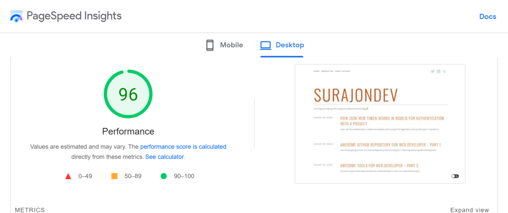{width="8.333333333333334in"
height="3.5in"}

PageSpeed offers insightful information about how quickly a website
loads. By focusing on these parameters, you can increase the speed of
your website. It supports both desktop and mobile users and offers
different insights.

#### [Sass](https://sass-lang.com/)

Sass is the most mature, stable, and powerful professional- grade CSS
extension language in the world.

{width="8.333333333333334in"
height="3.5in"}

A preprocessor called Sass enhances CSS's functionality. It has many
different powers.

#### [Chrome Dev Tools](https://www.google.com/intl/en_in/chrome/)

Chrome DevTools is a set of web developer tools built directly into the
Google Chrome browser.

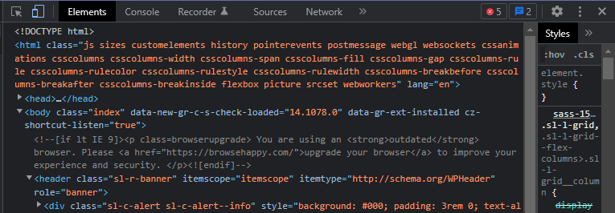{width="6.375in"
height="2.216666666666667in"}

The best web development tools are already included in your browser. The
developer tools that Chrome offers are fantastic. You may check the
responsiveness of your website, view all the code, obtain network
information, and do a lot more.

#### [MongoDB Atlas](https://www.mongodb.com/atlas/database)

The multi-cloud database service at the heart of our developer data
platform accelerates and simplifies how you build with data. Try MongoDB
Atlas today!

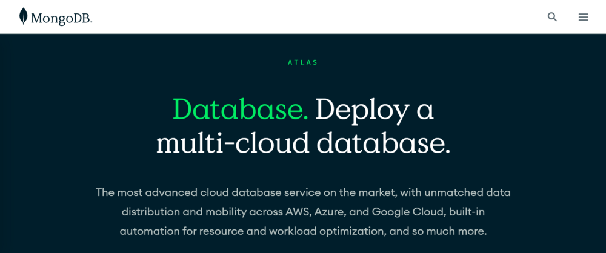{width="8.333333333333334in"
height="3.4833333333333334in"}

Among the top databases for Web developers that accept JSON-formatted
data. The cloud-based extension for MongoDB is called Atlas. With Atlas,
you can connect your application straight to the internet server without
having to set up a local database. This database is what I favour
utilising for my React projects.

### Conclusion üìí

With that, the full list would be finished. üò¥

{width="4.166666666666667in"
height="2.9166666666666665in"}

I hope that this collection will assist you in finding the best one for
your upcoming project.

Do tell me which one you are utilizing from the list or out of the list
in the comment area below. Don't forget to distribute this list to your
coworkers, friends as well; after all, caring is sharing. üòç

### GitHub URL for this article 💻

[**GitHub - devangtomar/medium-awesome-web-tools: GitHub repo created
for medium article : \"50+...**\
*Welcome to the comprehensive list of more than 50 tools and resources
that have been useful to me as I\'ve learned
(and...*github.com](https://github.com/devangtomar/medium-awesome-web-tools)

### Let's connect and chat! Open to anything under the sun 🏖️🍹

**🐦 Twitter :** [devangtomar7](https://twitter.com/devangtomar7)\
**🔗 LinkedIn :**
[devangtomar](https://www.linkedin.com/in/devangtomar)\
**📚 Stackoverflow :**
[devangtomar](https://stackoverflow.com/users/8198097/devangtomar)\
**🖼️ Instagram :** [be_ayushmann](https://instagram.com/be_ayushmann)\
Ⓜ️ **Medium :** [Devang
Tomar](https://medium.com/u/8f5e1c86129d?source=post_page-----e42119a306ca--------------------------------)\
☊ **Hashnode :** [devangtomar](https://devangtomar.hashnode.dev/)\
**🧑‍💻 Dev.to :** [devangtomar](https://dev.to/devangtomar)
